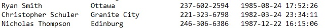
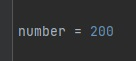

# Base Generator
Full Name + American City + Phone Number + Date 

File [simple_base.py](simple_base.py) will generate simple base like:
 

With editing value of **number** you controlling new pack of data that will be **added** to your file
 

And of course don't forget to:

**pip install names**
